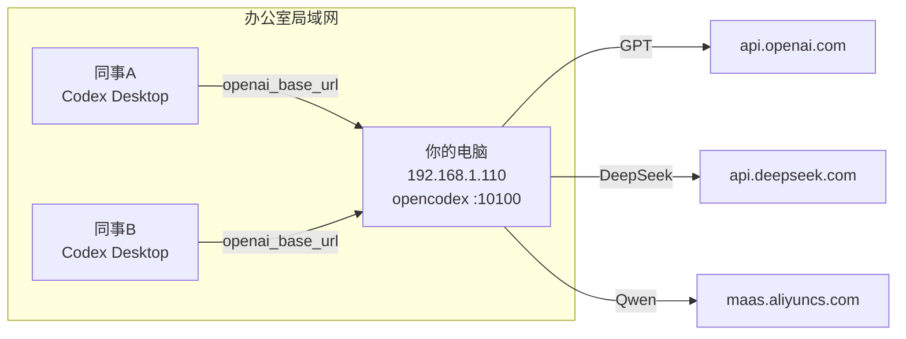

# opencodex LAN Share

> 一套脚本和文档，将本机 opencodex 代理共享给办公室局域网内的同事使用。

[](LICENSE)
[](https://github.com/anthropics/opencodex)

## 这是什么？

opencodex 是一个多模型路由代理。本仓库提供：
- **服务端脚本**：一键配置防火墙、服务、访问密钥
- **客户端脚本**：同事一键接入你的代理
- **自动化测试**：17 项 TDD 测试覆盖连通性、模型、流式输出
- **完整文档**：架构原理、故障排查、安全指南

## 架构一览



**核心原理**：同事的 Codex 把 API 请求发到你机器的 opencodex 代理，代理根据模型名路由到对应的云服务商，使用**你的** API Key 完成调用。同事全程看不到你的密钥。

## 快速开始

### 服务端（你的机器） — 2 分钟

```powershell
# 1. 以管理员身份打开 PowerShell
# 2. 运行配置脚本
.\scripts\server\setup-lan.ps1

# 3. 创建同事的访问密钥
.\scripts\server\manage-users.ps1 -Create "张三"
```

记下输出的密钥和你的局域网 IP（如 `192.168.1.110`）。

### 客户端（同事的机器） — 1 分钟

将以下信息发给同事：
- 代理地址：`http://192.168.1.110:10100/v1`
- 本仓库的 `scripts\client\` 目录

同事运行：

```powershell
.\scripts\client\setup-client.ps1 -ServerIp 192.168.1.110
```

配置完成后，打开 Codex Desktop，在模型选择器中就能看到所有可用模型（包括 qwen-cloud/*、deepseek/* 等）。

## 项目结构

```
opencodex-lan-share/
├── README.md                       # 本文件
├── docs/
│   ├── architecture.md             # 架构原理（Mermaid 图）
│   ├── troubleshooting.md          # 常见问题排查
│   └── security.md                 # 安全说明
├── scripts/
│   ├── server/
│   │   ├── setup-lan.ps1           # 服务端一键配置
│   │   └── manage-users.ps1        # 用户密钥管理
│   └── client/
│       ├── setup-client.ps1        # Windows 客户端配置
│       └── setup-client.sh         # macOS/Linux 客户端配置
├── tests/
│   ├── test-connectivity.ps1       # 连通性测试（6 项）
│   ├── test-models.ps1             # 模型可用性测试（6 项）
│   └── test-stream.ps1             # 流式输出测试（5 项）
├── templates/
│   └── client-config.toml          # 客户端配置模板
└── tools/
    └── diagnostics.ps1             # 双向诊断工具
```

## 测试

```powershell
# 服务端测试
.\tests\test-connectivity.ps1
.\tests\test-models.ps1 -AccessKey <key>
.\tests\test-stream.ps1 -AccessKey <key>

# 客户端测试
.\tests\test-connectivity.ps1 -ServerIp 192.168.1.110
```

## 前置条件

- **服务端**：Windows 11 + opencodex v2.10.1+
- **客户端**：任何操作系统 + Codex Desktop 或 Codex CLI
- **网络**：所有机器在同一局域网（同一子网）

## 文档

- [架构原理](docs/architecture.md)
- [故障排查](docs/troubleshooting.md)
- [安全指南](docs/security.md)

## 常见问题

**Q: 同事能看到我的 API Key 吗？**
A: 不能。API Key 只存在你机器的 `~/.opencodex/config.json` 里，不会传给同事。

**Q: 费用算谁的？**
A: 你的。所有通过代理的请求都使用你的阿里云百炼、DeepSeek 等账户计费。

**Q: 如何吊销某个同事的访问权限？**
A: `.\scripts\server\manage-users.ps1 -Revoke <key-id>`

**Q: 电脑关机后还能用吗？**
A: 不能。你的机器需要一直开着。建议运行 `setup-lan.ps1` 安装后台服务（开机自启）。

## License

MIT
