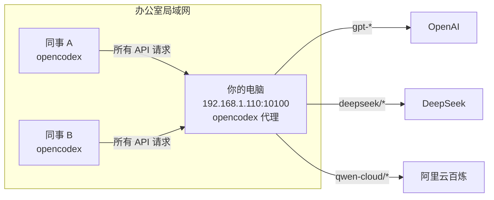

# opencodex LAN Share

> 将本机 opencodex 代理共享给办公室局域网内同事使用的一键脚本 + 自动化测试 + 完整文档。

[](LICENSE)
[](https://github.com/anthropics/opencodex)
[](tests/)

## 这是什么？

你在本机用 opencodex 接入了阿里云百炼（qwen-cloud）、DeepSeek 等多个模型供应商。这个项目让你**一键把代理共享给办公室同事**——同事的 Codex 发请求到你的机器，你的机器用你的 API Key 去调模型，然后把结果返回。

- 同事**看不到**你的 API Key
- 费用统一走你的账户，方便管理
- 随时可以**单条命令吊销**某个人的访问权限
- 支持 Windows / macOS / Linux 客户端

## 架构



**一句话原理**：opencodex 是一个运行在你机器上的 HTTP 代理（端口 10100），同事的 opencodex 把 `base_url` 指向你的 IP，所有模型请求经过代理自动路由到对应的云服务商。

## 前置条件

| 角色 | 要求 |
|------|------|
| 服务端 | Windows 11 + opencodex v2.10.1+ + 管理员权限 |
| 客户端 | 任意操作系统 + **opencodex（脚本自动安装）** + Node.js（脚本自动安装） |
| 网络 | 所有机器在同一局域网子网内 |

> **重要**：同事机器上必须安装 opencodex，否则 `config.toml` 中的 `model_provider = "opencodex"` 等配置项无法被识别，模型列表不会更新。客户端脚本已内置自动安装逻辑——只需确保同事机器能访问 npm registry。

## 快速开始

### 第一步：服务端配置（你的机器）

```powershell
# 右键 PowerShell → 以管理员身份运行
cd D:\Project\opencodex-lan-share

# 一键配置：防火墙放行 + 代理启动 + 开机服务
.\scripts\server\setup-lan.ps1

# 为同事创建访问密钥
.\scripts\server\manage-users.ps1 -Create "张三"
```

记下输出的密钥和你的局域网 IP（如 `192.168.1.110`）。

### 第二步：为同事创建密钥

```powershell
# 每个同事一个密钥，方便管理和吊销
.\scripts\server\manage-users.ps1 -Create "张三"
```

> 记下输出的密钥（只显示一次！），和你的局域网 IP 一起发给同事。

### 第三步：同事接入

发给同事的话术模板（替换 IP 和密钥）：

> 办公室部署了共享 AI 代理，打开 PowerShell 粘贴下面这行就行：

#### 方式一：一键命令（推荐，无需下载任何东西）

> 管理员先把**服务器 IP** 和**访问密钥** 发给同事。

**Windows 同事：** 打开 PowerShell，粘贴运行（把 `IP` 和 `密钥` 替换为实际值）：

```powershell
powershell -NoProfile -ExecutionPolicy Bypass -Command "iwr -Uri 'https://raw.githubusercontent.com/orulink-ai/opencodex-lan-share/main/scripts/client/setup-client.ps1' -OutFile 'setup.ps1'; .\setup.ps1 -ServerIp 192.168.1.110 -AccessKey ocx_data_xxxx"
```

> ⚠️ 把 `192.168.1.110` 换成实际 IP，`ocx_data_xxxx` 换成管理员给你的密钥。
> 注意：密钥**只显示一次**，请妥善保存。

**macOS / Linux 同事：** 打开终端，粘贴运行：

```bash
curl -fsSL https://raw.githubusercontent.com/orulink-ai/opencodex-lan-share/main/scripts/client/setup-client.sh | bash -s -- 192.168.1.110 ocx_data_xxxx
```

> ⚠️ 把 `192.168.1.110` 换成实际 IP，`ocx_data_xxxx` 换成管理员给你的密钥。

#### 方式二：手动下载（如果 GitHub 访问不了）

1. 让同事浏览器打开：`https://github.com/orulink-ai/opencodex-lan-share`
2. 点绿色 `Code` 按钮 → `Download ZIP`
3. 解压后进入 `scripts\client\` 目录
4. Windows：右键 `setup-client.ps1` → 使用 PowerShell 运行，输入服务器 IP 和密钥
5. Mac/Linux：`bash setup-client.sh 192.168.1.110 ocx_data_xxxx`

#### 配置完成后

打开 Codex Desktop，模型选择器里就能看到所有模型了（`qwen-cloud/*`、`deepseek/*` 等），选一个直接用。不需要输入任何 API Key。

> **脚本会自动完成以下操作：**
> 1. 检测并安装 Node.js（如未安装）
> 2. 检测并安装 opencodex（`npm install -g opencodex`）
> 3. 测试与服务器的连通性
> 4. 配置 `~/.codex/config.toml`（设置 `base_url`、`model_provider` 等）
> 5. 设置 `OPENAI_API_KEY` 环境变量
> 6. 验证 opencodex 能正确读取配置

## 项目结构

```
opencodex-lan-share/
├── README.md                       # 本文件
├── LICENSE                         # MIT 开源协议
├── docs/                           # 文档
│   ├── architecture.md             # 架构原理（Mermaid 流程图）
│   ├── troubleshooting.md          # 常见问题排查指南
│   └── security.md                 # 安全说明与最佳实践
├── scripts/                        # 脚本
│   ├── server/                     # 服务端（你的机器）
│   │   ├── setup-lan.ps1           # 一键配置（防火墙 + 服务 + 密钥）
│   │   ├── setup-lan.sh            # macOS/Linux 服务端
│   │   ├── auth-proxy.py           # 认证转发代理
│   │   ├── manage-users.ps1        # 同事密钥管理（增删查）
│   │   └── manage-users.sh         # macOS/Linux 密钥管理
│   └── client/                     # 客户端（同事的机器）
│       ├── setup-client.ps1        # Windows 一键接入（含自动安装 opencodex）
│       └── setup-client.sh         # macOS/Linux 一键接入（含自动安装 opencodex）
├── tests/                          # 自动化测试（TDD）
│   ├── test-connectivity.ps1       # 连通性测试 6 项
│   ├── test-models.ps1             # 模型可用性测试 6 项
│   ├── test-stream.ps1             # 流式输出测试 5 项
│   ├── test-client-windows.ps1     # Windows 客户端配置测试 19 项
│   ├── test-client-macos.sh        # macOS 客户端配置测试
│   └── test-server-macos.sh        # macOS 服务端测试
├── templates/                      # 配置模板
│   └── client-config.toml          # 客户端 Codex 配置模板
└── tools/                          # 工具
    ├── diagnostics.ps1             # 双向诊断工具（服务端/客户端通用）
    └── diagnostics.sh              # macOS/Linux 诊断工具
```

## 运行测试

```powershell
# 服务端全量测试
.\tests\test-connectivity.ps1
.\tests\test-models.ps1 -AccessKey <你的访问密钥>
.\tests\test-stream.ps1 -AccessKey <你的访问密钥>

# 客户端连通性测试
.\tests\test-connectivity.ps1 -ServerIp 192.168.1.110

# Windows 客户端配置测试（TDD）
.\tests\test-client-windows.ps1
```

## 常用管理命令

```powershell
# 查看所有同事的密钥
.\scripts\server\manage-users.ps1 -List

# 创建新同事密钥
.\scripts\server\manage-users.ps1 -Create "李四"

# 吊销某个密钥（同事离职/滥用时）
.\scripts\server\manage-users.ps1 -Revoke <密钥ID>

# 诊断问题
.\tools\diagnostics.ps1
.\tools\diagnostics.ps1 -ServerIp 192.168.1.110   # 客户端诊断
```

## 常见问题

**Q: 同事能看到我的 API Key 吗？**
A: **不能。** 你的阿里云百炼、DeepSeek 等 API Key 只存在 `~/.opencodex/config.json` 里，永远不会传给同事的机器。

**Q: 同事打开 Codex 后模型列表不更新怎么办？**
A: 99% 的情况是同事机器上没有安装 opencodex。请让同事重新运行客户端脚本（脚本会自动检测并安装），或手动执行 `npm install -g opencodex`，然后完全退出 Codex Desktop 再重新打开。

**Q: 费用算谁的？**
A: **你的。** 所有通过代理的 API 调用都走你的账户计费。建议在阿里云百炼控制台设置预算告警。

**Q: 如何吊销某个同事的访问权限？**
A: `.\scripts\server\manage-users.ps1 -Revoke <密钥ID>`，即时生效。

**Q: 你的电脑关机了还能用吗？**
A: **不能。** 代理在你机器上运行，关机就断了。建议运行 `setup-lan.ps1` 安装 Windows 服务（开机自启）。

**Q: 能支持多少个同事同时用？**
A: 取决于你的 API 账户的并发限制（阿里云百炼默认有 QPS 限制）。一般 5-10 人没问题。

**Q: 代理和 Codex Desktop 能同时在你机器上用吗？**
A: **能。** 你自己用 `127.0.0.1:10100`，同事用 `192.168.1.110:10100`，互不影响。

**Q: 安全吗？**
A: 代理走 **HTTP 明文**（局域网内），适合**可信办公网络**。不要做公网端口映射。如果需要外网访问，建议用 Tailscale 组虚拟局域网。详见[安全指南](docs/security.md)。

## 更多文档

- [架构原理详解 →](docs/architecture.md)
- [故障排查指南 →](docs/troubleshooting.md)
- [安全最佳实践 →](docs/security.md)

## 参与贡献

1. Fork 本仓库
2. 创建功能分支 (`git checkout -b feat/xxx`)
3. 提交修改 (`git commit -m 'feat: 添加xxx功能'`)
4. 推送到分支 (`git push origin feat/xxx`)
5. 提交 Pull Request

## License

MIT © orulink
