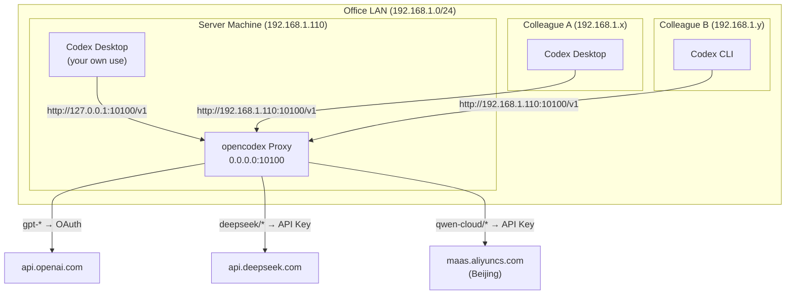

# opencodex LAN Share - Architecture

## Overview

opencodex LAN Share turns a single machine's opencodex proxy into a **shared LAN gateway** for the entire office. Colleagues connect their Codex clients to your machine, and opencodex routes their requests to the correct model providers — using your API keys, your billing, and your model catalog.

## System Architecture



## Key Design Principles

### 1. Single Source of Truth for API Keys
All provider API keys live **only on the server machine** in `~/.opencodex/config.json`. Colleagues never see them. Each colleague gets their own **access key** (an opencodex admission token), which can be individually revoked.

### 2. Model Routing by Prefix
opencodex uses model name prefixes to route requests:
- `gpt-*` → OpenAI (ChatGPT backend, OAuth)
- `deepseek/*` → DeepSeek API
- `qwen-cloud/*` → Alibaba Cloud Model Studio

### 3. OpenAI-Compatible API Surface
Everything speaks the OpenAI `/v1/chat/completions` protocol. Codex clients are configured with `openai_base_url` pointing to the proxy. No special SDK needed.

## Network Flow

```mermaid
sequenceDiagram
    participant C as Colleague's Codex
    participant P as opencodex Proxy<br/>(your machine)
    participant A as Alibaba MaaS

    C->>P: POST /v1/chat/completions<br/>model: qwen-cloud/qwen3-coder-plus<br/>Authorization: Bearer &lt;access-key&gt;
    P->>P: Validate access key
    P->>P: Route by model prefix → qwen-cloud provider
    P->>A: POST /compatible-mode/v1/chat/completions<br/>Authorization: Bearer &lt;your-aliyun-key&gt;
    A-->>P: Streaming SSE response
    P-->>C: Streaming SSE response<br/>(transparent proxy)
```

## Security Boundaries

| Layer | What's Protected | How |
|-------|-----------------|-----|
| Provider API Keys | Never leave server | Stored in `~/.opencodex/config.json` |
| Access Keys | Per-colleague tokens | Managed via `ocx access key create/revoke` |
| Network | LAN-only | Firewall rule restricts to Private profile |
| Admin Token | Server control | `~/.opencodex/admin-api-token` (never shared) |

## Configuration Files

| File | Purpose | Location |
|------|---------|----------|
| `config.json` | Proxy providers, port, hostname | `~/.opencodex/` |
| `admin-api-token` | Admin API auth token | `~/.opencodex/` |
| `config.toml` | Codex client settings | `~/.codex/` |
| `opencodex-catalog.json` | Model catalog cache | `~/.codex/` |

## How Codex Connects

The key configuration that routes Codex through the proxy:

```toml
# ~/.codex/config.toml (or equivalent)
openai_base_url = "http://192.168.1.110:10100/v1"
```

This single setting tells Codex: "send all API requests here instead of api.openai.com." The proxy handles the rest.
